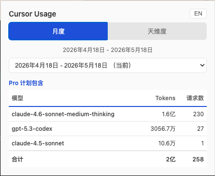
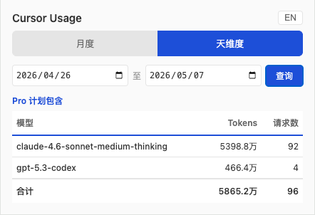
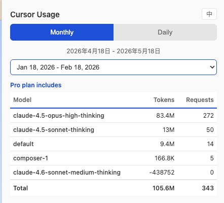

# Cursor Usage Viewer

非官方工具，与 Cursor 官方无任何关联。

Chrome 浏览器扩展，查看 Cursor 各 AI 模型的用量统计。支持月度和天维度切换、历史月份查看——解决了官方面板无法切换月份的问题。

## 功能

- 月度视图：查看当前及过去 24 个月的计费周期用量，按模型汇总
- 天维度视图：选择任意日期范围，查看逐日用量明细（默认当天）
- 表格展示：与官方格式一致的模型 / Tokens / 请求数表格
- 差值计算：自动处理 API 返回的累积数据，精确展示单月用量

## 安装

1. 下载或克隆本项目
2. 打开 Chrome，访问 `chrome://extensions/`
3. 开启右上角「开发者模式」
4. 点击「加载已解压的扩展程序」，选择本项目根目录
5. 确保**已登录 cursor.com**（扩展需要借助 cursor.com 页面的登录状态）
6. 点击扩展图标即可查看用量

## 注意事项

- 使用前必须有一个已登录 cursor.com 的浏览器标签页
- 扩展通过注入脚本到 cursor.com 页面来获取数据，请求的 Origin 为 cursor.com 自身
- 扩展不会收集、存储或传输任何数据到第三方
- 仅读取用户有权查看的用量信息

## 法律声明

- 本项目为个人开源工具，与 Cursor 官方无任何隶属、授权或代言关系
- 仅帮助用户查看自己的用量数据，通过浏览器登录态访问，不绕过任何安全机制
- 使用的 API 为用户在 cursor.com 正常登录后即可访问的公开接口
- 不以任何形式商业化 Cursor 的数据或服务
- 使用者应遵守 Cursor 的服务条款

## License

MIT License